# LLM Endpoints - Complete Beginner Guide

## Overview
This guide provides step-by-step instructions for monitoring, creating, and troubleshooting LLM endpoints in Azure Databricks for total beginners.

## 🎯 How Azure Databricks Powers Your LLM Infrastructure

```mermaid
graph TB
    subgraph "Azure as the AI Engine"
        A[💻 Compute Power<br/>High-performance GPUs<br/>& scalable cloud] --> F[🤖 AI Workflows]
        B[📊 Data + Integration<br/>Azure Data Lake +<br/>Synapse] --> F
        C[🔒 Security + Compliance<br/>Enterprise-grade<br/>defense & identity] --> F
        D[⚡ AI + Automation<br/>Intelligent workflows<br/>faster decisions] --> F
        E[🌍 Global Scale<br/>68+ regions] --> F
    end
    
    F --> G[🎯 End-to-End AI Workflows]
    
    style A fill:#1e90ff,stroke:#fff,stroke-width:2px,color:#fff
    style B fill:#1e90ff,stroke:#fff,stroke-width:2px,color:#fff
    style C fill:#1e90ff,stroke:#fff,stroke-width:2px,color:#fff
    style D fill:#1e90ff,stroke:#fff,stroke-width:2px,color:#fff
    style E fill:#1e90ff,stroke:#fff,stroke-width:2px,color:#fff
    style F fill:#00d4aa,stroke:#fff,stroke-width:3px,color:#000
    style G fill:#ff6b6b,stroke:#fff,stroke-width:3px,color:#fff
```

### 📈 Enterprise Benefits

| Benefit | Impact |
|---------|--------|
| ⚡ **60-70% faster data processing** | With Azure Synapse + AI automation |
| 💰 **Cost-efficient scaling** | Pay-as-you-grow model |
| 🌐 **Low-latency global delivery** | For millions of users simultaneously |
| 🛡️ **Built-in reliability** | 99.99% uptime with disaster recovery |

---

## 🏗️ Complete LLM Endpoint Architecture


---

## Prerequisites & Setup

### 1. Environment Setup
- [ ] **Azure Account**: Ensure you have access to Azure Portal with appropriate permissions
- [ ] **Azure Databricks Workspace**: Get access to your organization's Databricks workspace
- [ ] **Databricks CLI**: Install Databricks CLI version 0.205 or above
  ```bash
  pip install databricks-cli
  ```
- [ ] **Databricks Runtime**: Verify workspace has Databricks Runtime 13.0 ML or above
- [ ] **MLflow**: Install MLflow 2.9 or above
  ```bash
  pip install mlflow[genai]>=2.9.0
  ```
- [ ] **Authentication**: Get personal access token from Databricks workspace settings

### 2. API Keys & Credentials
- [ ] **OpenAI API Key**: Obtain from your OpenAI account (if using OpenAI models)
- [ ] **Azure OpenAI Key**: Get from Azure Portal (if using Azure OpenAI)
- [ ] **Other Provider Keys**: Anthropic, Cohere, etc. (based on your needs)
- [ ] **Store Secrets Securely**: Never hardcode API keys in scripts

---

## Phase 1: Discovery & Inventory

### 🔄 Discovery Workflow

```mermaid
flowchart TD
    Start([🎯 Start Discovery]) --> A[📋 List All Endpoints]
    A --> B{Endpoint<br/>Exists?}
    B -->|Yes| C[📊 Document Details]
    B -->|No| End1([✅ No Endpoints Found])
    
    C --> D[🔍 Identify Type]
    D --> E{Internal or<br/>External?}
    
    E -->|Internal| F[📦 Custom Model]
    E -->|External| G[🌐 OpenAI/Anthropic/etc]
    
    F --> H[📝 Record Config]
    G --> H
    
    H --> I[👥 Map to Team/Project]
    I --> J{More<br/>Endpoints?}
    
    J -->|Yes| A
    J -->|No| K[📊 Create Inventory]
    
    K --> L[🔍 Identify Duplicates]
    L --> M[🚨 Flag Unused/POC]
    M --> End2([✅ Discovery Complete])
    
    style Start fill:#00d4aa,stroke:#fff,stroke-width:2px,color:#000
    style End1 fill:#00d4aa,stroke:#fff,stroke-width:2px,color:#000
    style End2 fill:#00d4aa,stroke:#fff,stroke-width:2px,color:#000
    style K fill:#ff6b6b,stroke:#fff,stroke-width:2px,color:#fff
    style L fill:#ffa500,stroke:#fff,stroke-width:2px,color:#fff
    style M fill:#ffa500,stroke:#fff,stroke-width:2px,color:#fff
```

### Task 1: Identify Existing LLM Endpoints
- [ ] **List all serving endpoints** in your Databricks workspace
  - Navigate to: Databricks Workspace → Serving → Endpoints
  - Document each endpoint name, status, and owner
  
- [ ] **Check endpoint status** using UI or API:
  ```bash
  GET /api/2.0/serving-endpoints/{name}
  ```
  - Possible statuses: Ready, Ready (Update failed), Not ready (Updating), Not ready (Update failed), Not ready (Stopped)

- [ ] **Identify endpoint types**:
  - Internal (custom models)
  - External (OpenAI, Anthropic, etc.)
  - Foundation models

- [ ] **Map endpoints to projects/teams**:
  - Source to Pay projects
  - Record to Report projects
  - Manufacturing projects
  - Other business units

### Task 2: Document Current State
- [ ] **Create inventory spreadsheet** with columns:
  - Endpoint Name
  - Type (Internal/External)
  - Model Name/Version
  - Provider (OpenAI, Azure OpenAI, Anthropic, etc.)
  - Environment (Dev/Test/Prod)
  - Owner/Team
  - Creation Date
  - Last Updated
  - Status
  - Cost Attribution/Budget Policy
  
- [ ] **Identify duplicate or unused endpoints**:
  - Flag endpoints created for POCs
  - Note endpoints with no recent usage
  - Identify overlapping/duplicate configurations

---

## Phase 2: Security & Secrets Management

### 🔐 Security Flow: From API Key to Secure Endpoint

```mermaid
flowchart LR
    subgraph "Step 1: Obtain Keys"
        A1[🔑 OpenAI API Key]
        A2[🔑 Azure OpenAI Key]
        A3[🔑 Anthropic Key]
    end
    
    subgraph "Step 2: Create Secret Scope"
        B[🔒 Databricks Secret Scope<br/>databricks secrets create-scope]
    end
    
    subgraph "Step 3: Store Secrets"
        C[💾 Store as Secret<br/>databricks secrets put-secret]
    end
    
    subgraph "Step 4: Reference in Config"
        D[📝 Endpoint Config<br/>secrets/scope/key]
    end
    
    subgraph "Step 5: Deploy Endpoint"
        E[🚀 Secure Endpoint<br/>No exposed keys]
    end
    
    A1 --> B
    A2 --> B
    A3 --> B
    B --> C
    C --> D
    D --> E
    
    F[❌ Never Hardcode Keys] -.->|Avoid| A1
    G[❌ No Keys in Git] -.->|Avoid| D
    
    style B fill:#1e90ff,stroke:#fff,stroke-width:2px,color:#fff
    style C fill:#1e90ff,stroke:#fff,stroke-width:2px,color:#fff
    style E fill:#00d4aa,stroke:#fff,stroke-width:2px,color:#000
    style F fill:#ff0000,stroke:#fff,stroke-width:2px,color:#fff
    style G fill:#ff0000,stroke:#fff,stroke-width:2px,color:#fff
```

### Task 3: Secure API Keys
- [ ] **Create Databricks Secret Scopes**:
  ```bash
  databricks secrets create-scope <scope-name>
  ```
  Example:
  ```bash
  databricks secrets create-scope my_openai_secret_scope
  ```

- [ ] **Store API keys as secrets**:
  ```bash
  databricks secrets put-secret <scope-name> <key-name>
  ```
  Example:
  ```bash
  databricks secrets put-secret my_openai_secret_scope openai_api_key
  ```

- [ ] **Remove hardcoded API keys** from existing endpoints
- [ ] **Update endpoint configurations** to use secrets:
  ```python
  "openai_api_key": "{{secrets/my_openai_secret_scope/openai_api_key}}"
  ```

---

## Phase 3: Creating LLM Endpoints

### 🎨 Endpoint Creation Process

```mermaid
stateDiagram-v2
    [*] --> Planning: Define Requirements
    
    Planning --> Configuration: Choose Model & Provider
    note right of Configuration
        - Select model (GPT-4, Claude, etc.)
        - Define task type (chat, completions, embeddings)
        - Set rate limits
    end note
    
    Configuration --> SecretSetup: Configure Secrets
    note right of SecretSetup
        - Store API keys securely
        - Reference in config
        - No hardcoded credentials
    end note
    
    SecretSetup --> Creation: Create Endpoint
    note right of Creation
        - Use MLflow SDK or UI
        - Validate configuration
        - Set budget policy
    end note
    
    Creation --> Provisioning: Provisioning...
    Provisioning --> Testing: Test Queries
    
    Testing --> Ready: Endpoint Ready ✅
    Testing --> Failed: Creation Failed ❌
    
    Failed --> Debugging: Review Logs
    Debugging --> Configuration: Fix Issues
    
    Ready --> Monitoring: Active Monitoring
    Monitoring --> [*]: Operational
    
    note left of Monitoring
        - Track latency
        - Monitor costs
        - Check error rates
    end note
```

### 📊 Endpoint Types & Use Cases

```mermaid
graph TB
    subgraph "Chat Endpoints"
        A1[💬 GPT-4<br/>Advanced reasoning]
        A2[💬 GPT-3.5-turbo<br/>Fast & cost-effective]
        A3[💬 Claude-3<br/>Long context]
    end
    
    subgraph "Completion Endpoints"
        B1[📝 GPT-3.5-turbo-instruct<br/>Text completion]
        B2[📝 Codex<br/>Code generation]
    end
    
    subgraph "Embedding Endpoints"
        C1[🔤 text-embedding-ada-002<br/>General purpose]
        C2[🔤 text-embedding-3-large<br/>High performance]
    end
    
    subgraph "Use Cases"
        D1[🤖 Customer Support]
        D2[📊 Document Analysis]
        D3[🔍 Semantic Search]
        D4[💻 Code Assistant]
        D5[📄 Content Generation]
    end
    
    A1 --> D1
    A1 --> D2
    A2 --> D1
    A3 --> D2
    B1 --> D5
    B2 --> D4
    C1 --> D3
    C2 --> D3
    
    style A1 fill:#00d4aa,stroke:#fff,stroke-width:2px,color:#000
    style A2 fill:#00d4aa,stroke:#fff,stroke-width:2px,color:#000
    style A3 fill:#00d4aa,stroke:#fff,stroke-width:2px,color:#000
    style B1 fill:#1e90ff,stroke:#fff,stroke-width:2px,color:#fff
    style B2 fill:#1e90ff,stroke:#fff,stroke-width:2px,color:#fff
    style C1 fill:#9370db,stroke:#fff,stroke-width:2px,color:#fff
    style C2 fill:#9370db,stroke:#fff,stroke-width:2px,color:#fff
```

### Task 4: Create External Model Endpoints (OpenAI Example)

#### Using Python SDK:
- [ ] **Install required packages**:
  ```python
  %pip install mlflow[genai]>=2.9.0
  ```

- [ ] **Create a completions endpoint**:
  ```python
  import mlflow.deployments
  
  client = mlflow.deployments.get_deploy_client("databricks")
  client.create_endpoint(
      name="openai-completions-endpoint",
      config={
          "served_entities": [{
              "name": "openai-completions",
              "external_model": {
                  "name": "gpt-3.5-turbo-instruct",
                  "provider": "openai",
                  "task": "llm/v1/completions",
                  "openai_config": {
                      "openai_api_key": "{{secrets/my_openai_secret_scope/openai_api_key}}"
                  }
              }
          }]
      }
  )
  ```

- [ ] **Create a chat endpoint**:
  ```python
  client.create_endpoint(
      name="openai-chat-endpoint",
      config={
          "served_entities": [{
              "name": "openai-chat",
              "external_model": {
                  "name": "gpt-4",
                  "provider": "openai",
                  "task": "llm/v1/chat",
                  "openai_config": {
                      "openai_api_key": "{{secrets/my_openai_secret_scope/openai_api_key}}"
                  }
              }
          }]
      }
  )
  ```

- [ ] **Create an embeddings endpoint**:
  ```python
  client.create_endpoint(
      name="openai-embeddings-endpoint",
      config={
          "served_entities": [{
              "name": "openai-embeddings",
              "external_model": {
                  "name": "text-embedding-ada-002",
                  "provider": "openai",
                  "task": "llm/v1/embeddings",
                  "openai_config": {
                      "openai_api_key": "{{secrets/my_openai_secret_scope/openai_api_key}}"
                  }
              }
          }]
      }
  )
  ```

#### Using Databricks UI:
- [ ] Navigate to **Serving** → **Create Serving Endpoint**
- [ ] Select **External Model**
- [ ] Choose provider (OpenAI, Azure OpenAI, Anthropic, etc.)
- [ ] Configure model name and version
- [ ] Set rate limits and quotas
- [ ] Assign budget policy (if applicable)
- [ ] Click **Create**

### Task 5: Configure Azure OpenAI Endpoints
- [ ] **Create Azure OpenAI endpoint** with deployment name:
  ```python
  client.create_endpoint(
      name="azure-openai-endpoint",
      config={
          "served_entities": [{
              "name": "azure-openai-chat",
              "external_model": {
                  "name": "gpt-35-turbo",
                  "provider": "openai",
                  "task": "llm/v1/chat",
                  "openai_config": {
                      "openai_api_type": "azure",
                      "openai_api_key": "{{secrets/my_azure_openai_scope/azure_openai_key}}",
                      "openai_api_base": "https://your-resource.openai.azure.com",
                      "openai_deployment_name": "your-deployment-name",
                      "openai_api_version": "2023-05-15"
                  }
              }
          }]
      }
  )
  ```

---

## Phase 4: Configuration & Standardization

### Task 6: Set Up Endpoint Standards
- [ ] **Define naming conventions**:
  - Format: `{provider}-{model}-{environment}-{purpose}`
  - Example: `openai-gpt4-prod-chatbot`

- [ ] **Create standard configuration templates** for each use case:
  - Chatbots
  - Document analysis
  - Code generation
  - Embeddings/search
  
- [ ] **Set rate limits per endpoint**:
  ```python
  client.update_endpoint(
      endpoint="openai-completions-endpoint",
      config={
          "rate_limits": [{
              "key": "user",
              "renewal_period": "minute",
              "calls": 20
          }]
      }
  )
  ```

- [ ] **Implement environment separation**:
  - Development: Lower rate limits, test models
  - Testing: Production-like configuration
  - Production: Full rate limits, stable model versions

### Task 7: Implement Versioning Strategy
- [ ] **Document model versions** in use:
  - Track which projects use which model versions
  - Note when versions were deployed
  
- [ ] **Create deprecation policy**:
  - 30-day notice before deprecating endpoints
  - Migration path to newer versions
  - Sunset schedule for old endpoints

---

## Phase 5: Monitoring & Observability

### 📊 Monitoring Dashboard Architecture

```mermaid
graph TB
    subgraph "LLM Endpoints"
        A1[💬 Chat Endpoint]
        A2[📝 Completion Endpoint]
        A3[🔤 Embedding Endpoint]
    end
    
    subgraph "Metrics Collection"
        B1[⏱️ Latency<br/>Avg, P95, P99]
        B2[❌ Error Rate<br/>4xx, 5xx]
        B3[📈 Request Count<br/>Per minute/hour]
        B4[💰 Token Usage<br/>Input + Output]
        B5[💵 Cost Tracking<br/>Per endpoint/team]
    end
    
    subgraph "Analysis"
        C1[📊 Trends Analysis]
        C2[🚨 Anomaly Detection]
        C3[📉 Performance Degradation]
    end
    
    subgraph "Alerting"
        D1[⚠️ High Error Rate >5%]
        D2[🐌 High Latency >2s]
        D3[💸 Budget Overrun]
        D4[🚫 Endpoint Down]
    end
    
    subgraph "Actions"
        E1[📧 Email Notification]
        E2[💬 Teams/Slack Alert]
        E3[🔧 Auto-remediation]
        E4[📝 Incident Ticket]
    end
    
    A1 --> B1 & B2 & B3 & B4 & B5
    A2 --> B1 & B2 & B3 & B4 & B5
    A3 --> B1 & B2 & B3 & B4 & B5
    
    B1 --> C1 & C2 & C3
    B2 --> C1 & C2 & C3
    B3 --> C1 & C2
    B4 --> C1
    B5 --> C1
    
    C2 --> D1 & D2 & D3
    C3 --> D1 & D2 & D4
    
    D1 --> E1 & E2 & E4
    D2 --> E1 & E2
    D3 --> E1 & E2 & E4
    D4 --> E1 & E2 & E3 & E4
    
    style B1 fill:#1e90ff,stroke:#fff,stroke-width:2px,color:#fff
    style B2 fill:#1e90ff,stroke:#fff,stroke-width:2px,color:#fff
    style B3 fill:#1e90ff,stroke:#fff,stroke-width:2px,color:#fff
    style B4 fill:#1e90ff,stroke:#fff,stroke-width:2px,color:#fff
    style B5 fill:#1e90ff,stroke:#fff,stroke-width:2px,color:#fff
    style D1 fill:#ff6b6b,stroke:#fff,stroke-width:2px,color:#fff
    style D2 fill:#ff6b6b,stroke:#fff,stroke-width:2px,color:#fff
    style D3 fill:#ff6b6b,stroke:#fff,stroke-width:2px,color:#fff
    style D4 fill:#ff6b6b,stroke:#fff,stroke-width:2px,color:#fff
    style E3 fill:#00d4aa,stroke:#fff,stroke-width:2px,color:#000
```

### Task 8: Set Up Monitoring
- [ ] **Track key metrics**:
  - Request count per endpoint
  - Latency (average, p95, p99)
  - Error rates
  - Token usage per request
  - Cost per endpoint/team
  
- [ ] **Get endpoint status programmatically**:
  ```python
  from databricks.sdk import WorkspaceClient
  
  w = WorkspaceClient()
  endpoint = w.serving_endpoints.get(name="my-endpoint")
  print(f"Endpoint state: {endpoint.state.ready}")
  print(f"Update state: {endpoint.state.config_update}")
  ```

- [ ] **Check endpoint schema**:
  ```bash
  curl "https://<workspace>.databricks.com/api/2.0/serving-endpoints/<endpoint-name>/openapi" \
    -H "Authorization: Bearer <token>" \
    -H "Content-Type: application/json"
  ```

- [ ] **Set up alerting for**:
  - Endpoint failures
  - High error rates (>5%)
  - Increased latency (>2 seconds)
  - Budget overruns
  - Approaching rate limits

### Task 9: Usage & Cost Tracking
- [ ] **Assign budget policies** to endpoints:
  - Navigate to endpoint → Edit → Budget Policy
  - Select or create budget policy
  - Tag endpoints by team/project
  
- [ ] **Implement usage attribution**:
  - Tag requests with user ID
  - Tag requests with application name
  - Track token usage per team
  
- [ ] **Create cost dashboard** showing:
  - Daily/weekly/monthly costs per endpoint
  - Cost breakdown by team
  - Cost per project
  - Trends over time

---

## Phase 6: Querying & Testing

### Task 10: Test Endpoint Queries
- [ ] **Test completions endpoint**:
  ```python
  response = client.predict(
      endpoint="openai-completions-endpoint",
      inputs={
          "prompt": "What is the capital of France?",
          "temperature": 0.1,
          "max_tokens": 10
      }
  )
  print(response)
  ```

- [ ] **Test chat endpoint**:
  ```python
  response = client.predict(
      endpoint="openai-chat-endpoint",
      inputs={
          "messages": [
              {"role": "system", "content": "You are a helpful assistant."},
              {"role": "user", "content": "What is Azure Databricks?"}
          ],
          "temperature": 0.7,
          "max_tokens": 150
      }
  )
  print(response)
  ```

- [ ] **Test embeddings endpoint**:
  ```python
  response = client.predict(
      endpoint="openai-embeddings-endpoint",
      inputs={
          "input": "Sample text to embed"
      }
  )
  print(response)
  ```

- [ ] **Document expected response formats**
- [ ] **Create test suite** with various inputs
- [ ] **Validate error handling** (invalid inputs, rate limiting, etc.)

---

## Phase 7: Troubleshooting

### 🔧 Troubleshooting Decision Tree

```mermaid
flowchart TD
    Start([🚨 Issue Detected]) --> A{What's the<br/>problem?}
    
    A -->|Endpoint Not Ready| B[Check Status API]
    A -->|Query Failure| C[Check Error Code]
    A -->|High Latency| D[Check Performance]
    A -->|High Costs| E[Check Usage]
    
    B --> B1{Status?}
    B1 -->|Provisioning| B2[⏳ Wait 5-10 min]
    B1 -->|Failed| B3[📋 Check Build Logs]
    B3 --> B4{Error Type?}
    B4 -->|API Key| B5[🔑 Verify Secret]
    B4 -->|Config| B6[📝 Fix Configuration]
    B4 -->|Rate Limit| B7[⏰ Wait & Retry]
    
    C --> C1{Error Code?}
    C1 -->|400| C2[❌ Invalid Request<br/>Check input format]
    C1 -->|401| C3[🔐 Auth Failed<br/>Check API key]
    C1 -->|429| C4[⏱️ Rate Limited<br/>Reduce request rate]
    C1 -->|500| C5[🔥 Server Error<br/>Check logs]
    
    D --> D1[📊 Check Metrics]
    D1 --> D2{Latency Pattern?}
    D2 -->|Consistent High| D3[⚙️ Increase Workload Size]
    D2 -->|Spikes| D4[📈 Check Concurrent Load]
    D2 -->|Gradual Increase| D5[🔍 Check Model Drift]
    
    E --> E1[📊 Analyze Usage]
    E1 --> E2{Root Cause?}
    E2 -->|Too Many Tokens| E3[✂️ Optimize Prompts]
    E2 -->|High Volume| E4[🔄 Add Caching]
    E2 -->|Inefficient Calls| E5[⚡ Batch Requests]
    E2 -->|Wrong Model| E6[💡 Use Cheaper Model]
    
    B5 --> Fix([✅ Issue Resolved])
    B6 --> Fix
    B7 --> Fix
    C2 --> Fix
    C3 --> Fix
    C4 --> Fix
    C5 --> Escalate([🆘 Escalate to Support])
    D3 --> Fix
    D4 --> Fix
    D5 --> Fix
    E3 --> Fix
    E4 --> Fix
    E5 --> Fix
    E6 --> Fix
    
    style Start fill:#ff6b6b,stroke:#fff,stroke-width:2px,color:#fff
    style Fix fill:#00d4aa,stroke:#fff,stroke-width:2px,color:#000
    style Escalate fill:#ffa500,stroke:#fff,stroke-width:2px,color:#fff
    style B3 fill:#1e90ff,stroke:#fff,stroke-width:2px,color:#fff
    style C5 fill:#1e90ff,stroke:#fff,stroke-width:2px,color:#fff
    style D1 fill:#1e90ff,stroke:#fff,stroke-width:2px,color:#fff
    style E1 fill:#1e90ff,stroke:#fff,stroke-width:2px,color:#fff
```

### 🎯 Common Issues & Solutions Matrix

| Issue | Symptoms | Root Cause | Solution | Prevention |
|-------|----------|------------|----------|------------|
| 🔴 **Endpoint Not Ready** | Status: Provisioning/Failed | Config errors, invalid API key | Check build logs, verify secrets | Validate config before deployment |
| 🔴 **401 Unauthorized** | Query returns 401 | Expired/invalid API key | Rotate API key in secrets | Monitor key expiration |
| 🟡 **429 Rate Limited** | Too many requests error | Exceeded rate limits | Implement backoff, increase limits | Set appropriate rate limits |
| 🟡 **High Latency** | Slow responses >2s | Model size, concurrent load | Scale up, optimize prompts | Load testing, caching |
| 🟡 **High Costs** | Budget alerts | Token inefficiency | Optimize prompts, use caching | Cost monitoring, quotas |
| 🔴 **500 Server Error** | Internal errors | Provider issues, model problems | Check logs, retry, escalate | Health checks, fallbacks |

### Task 11: Debug Common Issues

#### Endpoint Not Ready
- [ ] **Check endpoint status**:
  ```bash
  GET /api/2.0/serving-endpoints/{name}
  ```
- [ ] **Review build logs**:
  ```bash
  GET /api/2.0/serving-endpoints/{name}/served-models/{served-model-name}/build-logs
  ```
- [ ] **Common causes**:
  - API key issues
  - Invalid configuration
  - Model not available in region
  - Rate limit exceeded during setup

#### Query Failures
- [ ] **Check model server logs**:
  ```bash
  GET /api/2.0/serving-endpoints/{name}/served-models/{served-model-name}/logs
  ```
- [ ] **Verify request format** matches endpoint schema
- [ ] **Check authentication** (token validity)
- [ ] **Verify rate limits** not exceeded
- [ ] **Common errors**:
  - 400: Bad request (invalid input format)
  - 401: Unauthorized (API key issue)
  - 429: Rate limit exceeded
  - 500: Server error (check logs)

#### Performance Issues
- [ ] **Monitor latency metrics**
- [ ] **Check for**:
  - Model size too large for workload
  - Rate limiting causing retries
  - Network connectivity issues
  - High concurrent request volume
- [ ] **Optimize by**:
  - Adjusting workload size
  - Implementing caching
  - Using smaller/faster models for simple tasks
  - Load balancing across endpoints

#### Cost Overruns
- [ ] **Review usage patterns**
- [ ] **Identify high-volume consumers**
- [ ] **Check for**:
  - Inefficient prompts (too many tokens)
  - Unnecessary API calls
  - Lack of caching
  - Test traffic in production
- [ ] **Implement controls**:
  - Stricter rate limits
  - User quotas
  - Budget alerts
  - Request caching

---

## Phase 8: Permissions & Governance

### Task 12: Manage Access Control
- [ ] **Review endpoint permissions**:
  - Navigate to Endpoint → Permissions button
  - Or use CLI:
  ```bash
  databricks permissions get serving-endpoints <endpoint-id>
  ```

- [ ] **Set permission levels**:
  - **CAN_QUERY**: Can send requests to endpoint
  - **CAN_MANAGE**: Can modify and delete endpoint
  - **IS_OWNER**: Full control

- [ ] **Grant user permissions**:
  ```bash
  databricks permissions update serving-endpoints <endpoint-id> --json '{
    "access_control_list": [
      {
        "user_name": "user@example.com",
        "permission_level": "CAN_QUERY"
      }
    ]
  }'
  ```

- [ ] **Grant group permissions** for teams:
  ```bash
  databricks permissions update serving-endpoints <endpoint-id> --json '{
    "access_control_list": [
      {
        "group_name": "data-science-team",
        "permission_level": "CAN_QUERY"
      }
    ]
  }'
  ```

- [ ] **Implement least privilege**:
  - Give CAN_QUERY to application service accounts
  - Give CAN_MANAGE only to endpoint owners
  - Regular access reviews

### Task 13: Lifecycle Management
- [ ] **Update endpoints** as needed:
  ```python
  client.update_endpoint(
      endpoint="my-endpoint",
      config={
          "served_entities": [{
              "name": "updated-model",
              "external_model": {
                  "name": "gpt-4-turbo",  # New model version
                  "provider": "openai",
                  "task": "llm/v1/chat",
                  "openai_config": {
                      "openai_api_key": "{{secrets/scope/key}}"
                  }
              }
          }]
      }
  )
  ```

- [ ] **Stop endpoints** when not in use:
  ```bash
  POST /api/2.0/serving-endpoints/{name}/config:stop
  ```

- [ ] **Start stopped endpoints**:
  ```bash
  POST /api/2.0/serving-endpoints/{name}/config:start
  ```

- [ ] **Delete deprecated endpoints**:
  ```python
  client.delete_endpoint(endpoint="old-endpoint-name")
  ```

---

## Phase 9: Automation & CI/CD Integration

### 🔄 Complete CI/CD Pipeline Architecture

```mermaid
flowchart LR
    subgraph "Developer Workflow"
        A1[👨‍💻 Developer] --> A2[📝 Create/Update<br/>Config File]
        A2 --> A3[🌿 Create Branch]
        A3 --> A4[📤 Push to Git]
    end
    
    subgraph "Pull Request"
        A4 --> B1[🔍 PR Created]
        B1 --> B2[✅ Validate Config]
        B2 --> B3{Valid?}
        B3 -->|No| B4[❌ PR Failed]
        B3 -->|Yes| B5[🚀 Deploy to Dev]
        B5 --> B6[🧪 Run Tests]
        B6 --> B7{Tests Pass?}
        B7 -->|No| B4
        B7 -->|Yes| B8[✅ PR Approved]
    end
    
    subgraph "Merge to Main"
        B8 --> C1[🔀 Merge PR]
        C1 --> C2[🔍 Validate Prod Config]
        C2 --> C3[🚀 Deploy to Prod]
        C3 --> C4[📝 Update Registry]
        C4 --> C5[📢 Notify Team]
    end
    
    subgraph "Monitoring"
        C5 --> D1[📊 Track Metrics]
        D1 --> D2[🔍 Health Checks]
        D2 --> D3{Healthy?}
        D3 -->|No| D4[🚨 Alert Team]
        D3 -->|Yes| D5[✅ Operational]
    end
    
    B4 --> A2
    D4 --> Rollback[↩️ Rollback]
    Rollback --> A2
    
    style B5 fill:#1e90ff,stroke:#fff,stroke-width:2px,color:#fff
    style C3 fill:#00d4aa,stroke:#fff,stroke-width:2px,color:#000
    style B4 fill:#ff6b6b,stroke:#fff,stroke-width:2px,color:#fff
    style D4 fill:#ff6b6b,stroke:#fff,stroke-width:2px,color:#fff
    style D5 fill:#00d4aa,stroke:#fff,stroke-width:2px,color:#000
```

### 🏗️ Repository Structure

```mermaid
graph TB
    Root[📁 LLM_Endpoints] --> Configs[📁 configs/]
    Root --> Scripts[📁 scripts/]
    Root --> Workflows[📁 .github/workflows/]
    Root --> Docs[📁 docs/]
    Root --> Tests[📁 tests/]
    
    Configs --> Dev[📁 dev/]
    Configs --> Test[📁 test/]
    Configs --> Prod[📁 prod/]
    
    Dev --> Chat1[📄 chatbot_endpoint.json]
    Dev --> Embed1[📄 embeddings_endpoint.json]
    Test --> Chat2[📄 chatbot_endpoint.json]
    Test --> Embed2[📄 embeddings_endpoint.json]
    Prod --> Chat3[📄 chatbot_endpoint.json]
    Prod --> Embed3[📄 embeddings_endpoint.json]
    
    Scripts --> Create[📄 create_endpoint.py]
    Scripts --> Update[📄 update_endpoint.py]
    Scripts --> Delete[📄 delete_endpoint.py]
    Scripts --> Validate[📄 validate_config.py]
    
    Workflows --> Deploy1[📄 deploy_dev.yml]
    Workflows --> Deploy2[📄 deploy_prod.yml]
    Workflows --> Test1[📄 test.yml]
    
    style Root fill:#1e90ff,stroke:#fff,stroke-width:2px,color:#fff
    style Configs fill:#00d4aa,stroke:#fff,stroke-width:2px,color:#000
    style Scripts fill:#9370db,stroke:#fff,stroke-width:2px,color:#fff
    style Workflows fill:#ffa500,stroke:#fff,stroke-width:2px,color:#fff
```

### 🔄 Git Workflow: From Code to Deployment

```mermaid
sequenceDiagram
    participant Dev as 👨‍💻 Developer
    participant Git as 📦 Git Repository
    participant CI as 🤖 GitHub Actions
    participant DB as 🔷 Databricks
    participant Endpoint as 🎯 LLM Endpoint
    participant Monitor as 📊 Monitoring
    
    Dev->>Git: 1. Push config changes
    Git->>CI: 2. Trigger workflow
    CI->>CI: 3. Validate config
    
    alt Config Valid
        CI->>DB: 4. Authenticate
        DB->>CI: 5. Token validated
        CI->>DB: 6. Create endpoint
        DB->>Endpoint: 7. Provision resources
        Endpoint->>DB: 8. Endpoint ready
        DB->>CI: 9. Success response
        CI->>Git: 10. Update status ✅
        CI->>Monitor: 11. Start monitoring
        Monitor->>Dev: 12. Send notification
    else Config Invalid
        CI->>Git: 10. Update status ❌
        CI->>Dev: 11. Notify failure
        Dev->>Git: 12. Fix and retry
    end
    
    loop Health Check
        Monitor->>Endpoint: Check status
        Endpoint->>Monitor: Return metrics
    end
```

### Task 14: Automate Endpoint Creation
- [ ] **Create Python script** for endpoint creation:
  ```python
  # create_endpoint.py
  import mlflow.deployments
  import json
  import sys
  
  def create_llm_endpoint(config_file):
      with open(config_file, 'r') as f:
          config = json.load(f)
      
      client = mlflow.deployments.get_deploy_client("databricks")
      
      try:
          endpoint = client.create_endpoint(
              name=config['name'],
              config=config['config']
          )
          print(f"Successfully created endpoint: {config['name']}")
          return endpoint
      except Exception as e:
          print(f"Error creating endpoint: {str(e)}")
          sys.exit(1)
  
  if __name__ == "__main__":
      create_llm_endpoint("endpoint_config.json")
  ```

- [ ] **Create configuration files** for each endpoint:
  ```json
  {
    "name": "my-endpoint",
    "config": {
      "served_entities": [{
        "name": "my-model",
        "external_model": {
          "name": "gpt-4",
          "provider": "openai",
          "task": "llm/v1/chat",
          "openai_config": {
            "openai_api_key": "{{secrets/scope/key}}"
          }
        }
      }],
      "rate_limits": [{
        "key": "user",
        "renewal_period": "minute",
        "calls": 100
      }]
    }
  }
  ```

### Task 15: Git Integration & Pull Request Workflow
- [ ] **Set up repository structure**:
  ```
  LLM_Endpoints/
  ├── configs/
  │   ├── dev/
  │   │   ├── chatbot_endpoint.json
  │   │   └── embeddings_endpoint.json
  │   ├── test/
  │   └── prod/
  ├── scripts/
  │   ├── create_endpoint.py
  │   ├── update_endpoint.py
  │   ├── delete_endpoint.py
  │   └── validate_config.py
  ├── .github/
  │   └── workflows/
  │       ├── deploy_dev.yml
  │       └── deploy_prod.yml
  └── README.md
  ```

- [ ] **Create GitHub Actions workflow** (or Azure DevOps pipeline):
  ```yaml
  # .github/workflows/deploy_endpoint.yml
  name: Deploy LLM Endpoint
  
  on:
    pull_request:
      paths:
        - 'configs/**/*.json'
    push:
      branches:
        - main
      paths:
        - 'configs/prod/**/*.json'
  
  jobs:
    validate:
      runs-on: ubuntu-latest
      steps:
        - uses: actions/checkout@v2
        
        - name: Set up Python
          uses: actions/setup-python@v2
          with:
            python-version: '3.9'
        
        - name: Install dependencies
          run: |
            pip install mlflow[genai]>=2.9.0
            pip install databricks-cli
        
        - name: Validate config
          run: python scripts/validate_config.py
    
    deploy_dev:
      needs: validate
      if: github.event_name == 'pull_request'
      runs-on: ubuntu-latest
      steps:
        - uses: actions/checkout@v2
        
        - name: Deploy to Dev
          env:
            DATABRICKS_HOST: ${{ secrets.DATABRICKS_HOST }}
            DATABRICKS_TOKEN: ${{ secrets.DATABRICKS_TOKEN }}
          run: python scripts/create_endpoint.py configs/dev/
    
    deploy_prod:
      needs: validate
      if: github.ref == 'refs/heads/main'
      runs-on: ubuntu-latest
      steps:
        - uses: actions/checkout@v2
        
        - name: Deploy to Prod
          env:
            DATABRICKS_HOST: ${{ secrets.DATABRICKS_HOST }}
            DATABRICKS_TOKEN: ${{ secrets.DATABRICKS_TOKEN }}
          run: python scripts/create_endpoint.py configs/prod/
  ```

- [ ] **Create validation script**:
  ```python
  # scripts/validate_config.py
  import json
  import os
  import sys
  
  def validate_endpoint_config(config_file):
      with open(config_file, 'r') as f:
          config = json.load(f)
      
      required_fields = ['name', 'config']
      for field in required_fields:
          if field not in config:
              print(f"Error: Missing required field '{field}' in {config_file}")
              return False
      
      # Add more validation logic
      # - Check naming conventions
      # - Validate provider config
      # - Verify secrets reference format
      
      print(f"✓ Valid configuration: {config_file}")
      return True
  
  if __name__ == "__main__":
      configs_dir = "configs/"
      all_valid = True
      
      for root, dirs, files in os.walk(configs_dir):
          for file in files:
              if file.endswith('.json'):
                  config_path = os.path.join(root, file)
                  if not validate_endpoint_config(config_path):
                      all_valid = False
      
      if not all_valid:
          sys.exit(1)
  ```

- [ ] **Document PR workflow** for team:
  1. Create feature branch
  2. Add/modify endpoint config in appropriate environment folder
  3. Run validation locally
  4. Create pull request
  5. Automated validation runs
  6. Dev endpoint deployed automatically for testing
  7. After PR approval, merge to main
  8. Prod endpoint deployed automatically

### Task 16: Implement Endpoint Registry
- [ ] **Create central registry** (database, spreadsheet, or config file):
  ```python
  # endpoint_registry.json
  {
    "endpoints": [
      {
        "name": "openai-gpt4-prod-chatbot",
        "environment": "production",
        "provider": "openai",
        "model": "gpt-4",
        "version": "2024-01",
        "owner": "data-science-team",
        "project": "AP Chatbot",
        "cost_center": "Finance",
        "created_date": "2024-01-15",
        "status": "active",
        "rate_limit": 100,
        "monthly_budget": 5000,
        "deprecation_date": null
      }
    ]
  }
  ```

- [ ] **Create registry update script** that runs after endpoint creation:
  ```python
  def update_registry(endpoint_details):
      with open('endpoint_registry.json', 'r') as f:
          registry = json.load(f)
      
      registry['endpoints'].append(endpoint_details)
      
      with open('endpoint_registry.json', 'w') as f:
          json.dump(registry, f, indent=2)
  ```

---

## Phase 10: Documentation & Knowledge Transfer

### Task 17: Create Documentation
- [ ] **Architecture Decision Record (ADR)** for LLM endpoint strategy
- [ ] **Standard Operating Procedures (SOPs)** for:
  - Creating new endpoints
  - Updating existing endpoints
  - Troubleshooting common issues
  - Requesting access to endpoints
  
- [ ] **API documentation** with examples:
  - Request/response formats
  - Authentication methods
  - Rate limits
  - Error codes
  
- [ ] **Runbooks** for common scenarios:
  - Incident response
  - Performance degradation
  - Cost spike investigation
  - Endpoint migration

### Task 18: Team Onboarding
- [ ] **Create onboarding checklist** for new users
- [ ] **Record tutorial videos** showing:
  - How to query existing endpoints
  - How to request new endpoints
  - How to monitor usage and costs
  
- [ ] **Set up office hours** or support channel
- [ ] **Create FAQ document** addressing common questions

---

## Success Metrics & KPIs

### Track These Metrics Monthly:
- [ ] **Number of managed endpoints** (target: 100% of LLM endpoints tracked)
- [ ] **Endpoint uptime** (target: >99.5%)
- [ ] **Average query latency** (target: <2 seconds)
- [ ] **Error rate** (target: <1%)
- [ ] **Cost per endpoint** (track trends)
- [ ] **Cost per team/project** (for accurate attribution)
- [ ] **Time to create new endpoint** (target: <1 hour)
- [ ] **Number of duplicate endpoints eliminated**
- [ ] **Number of teams onboarded to standard endpoints**
- [ ] **Incidents related to LLM endpoints** (target: decreasing trend)

---

## Quick Reference: Common Commands

### Get Endpoint Status
```bash
databricks serving-endpoints get <endpoint-name>
```

### List All Endpoints
```bash
databricks serving-endpoints list
```

### Create Secret
```bash
databricks secrets create-scope <scope-name>
databricks secrets put-secret <scope-name> <key-name>
```

### Query Endpoint (Python)
```python
import mlflow.deployments
client = mlflow.deployments.get_deploy_client("databricks")
response = client.predict(endpoint="<endpoint-name>", inputs={...})
```

### Update Rate Limits
```python
client.update_endpoint(
    endpoint="<endpoint-name>",
    config={"rate_limits": [{"key": "user", "renewal_period": "minute", "calls": 50}]}
)
```

### Stop Endpoint
```bash
databricks serving-endpoints stop <endpoint-name>
```

### Delete Endpoint
```bash
databricks serving-endpoints delete <endpoint-name>
```

---

## 🏢 Industry Use Cases: Where Azure AI Transforms Business

```mermaid
graph TB
    subgraph "Healthcare 🏥"
        H1[🔬 AI-assisted diagnostics]
        H2[📊 Predictive health analytics]
        H3[💊 Treatment recommendations]
    end
    
    subgraph "Finance 💰"
        F1[🕵️ Real-time fraud detection]
        F2[🤖 Automated compliance]
        F3[📈 Risk assessment]
    end
    
    subgraph "Manufacturing 🏭"
        M1[🔧 Predictive maintenance]
        M2[📊 Quality control]
        M3[⚙️ Process optimization]
    end
    
    subgraph "Retail 🛒"
        R1[🤖 Personalized shopping]
        R2[📦 Inventory optimization]
        R3[💬 Customer service bots]
    end
    
    Azure[☁️ Azure AI Platform] --> H1 & H2 & H3
    Azure --> F1 & F2 & F3
    Azure --> M1 & M2 & M3
    Azure --> R1 & R2 & R3
    
    style Azure fill:#0078d4,stroke:#fff,stroke-width:3px,color:#fff
    style H1 fill:#00d4aa,stroke:#fff,stroke-width:2px,color:#000
    style H2 fill:#00d4aa,stroke:#fff,stroke-width:2px,color:#000
    style H3 fill:#00d4aa,stroke:#fff,stroke-width:2px,color:#000
    style F1 fill:#1e90ff,stroke:#fff,stroke-width:2px,color:#fff
    style F2 fill:#1e90ff,stroke:#fff,stroke-width:2px,color:#fff
    style F3 fill:#1e90ff,stroke:#fff,stroke-width:2px,color:#fff
    style M1 fill:#9370db,stroke:#fff,stroke-width:2px,color:#fff
    style M2 fill:#9370db,stroke:#fff,stroke-width:2px,color:#fff
    style M3 fill:#9370db,stroke:#fff,stroke-width:2px,color:#fff
```

---

## Appendix: Project-Specific Endpoints

### 🔄 End-to-End AI Workflow per Project

```mermaid
flowchart LR
    subgraph "Source to Pay"
        S1[📄 Data Ingestion<br/>Purchase Requests] --> S2[🏋️ AI Model<br/>Document Processing]
        S2 --> S3[💡 Insights<br/>PO Creation, Classification]
    end
    
    subgraph "Record to Report"
        R1[📊 Data Ingestion<br/>Financial Data] --> R2[🏋️ AI Model<br/>Commentary Generation]
        R2 --> R3[💡 Insights<br/>Automated Reports]
    end
    
    subgraph "Manufacturing"
        M1[🏭 Data Ingestion<br/>Process Data] --> M2[🏋️ AI Model<br/>Knowledge Management]
        M2 --> M3[💡 Insights<br/>Optimization]
    end
    
    style S2 fill:#1e90ff,stroke:#fff,stroke-width:2px,color:#fff
    style R2 fill:#1e90ff,stroke:#fff,stroke-width:2px,color:#fff
    style M2 fill:#1e90ff,stroke:#fff,stroke-width:2px,color:#fff
    style S3 fill:#00d4aa,stroke:#fff,stroke-width:2px,color:#000
    style R3 fill:#00d4aa,stroke:#fff,stroke-width:2px,color:#000
    style M3 fill:#00d4aa,stroke:#fff,stroke-width:2px,color:#000
```

### Source to Pay
- **PR-PO Creation**: Document processing, field extraction
- **AP Chatbot**: Customer support, query handling
- **Commodity Code Classification**: Text classification, embeddings
- **Non-PO Invoice Automation**: OCR, data extraction

### Record to Report
- **CLM Commentary Automation**: Text generation, summarization

### Manufacturing
- **KMP (Knowledge Management Portal)**: Document search, embeddings, Q&A
- **TOM Manufacturing Bot**: Conversational AI, process assistance

### Recommended Endpoints per Use Case:
| Use Case | Endpoint Type | Recommended Model |
|----------|---------------|-------------------|
| Chatbot | Chat | GPT-4, GPT-3.5-turbo |
| Document Classification | Embeddings | text-embedding-ada-002 |
| Text Generation | Completions | GPT-4, Claude-2 |
| Code Generation | Chat | GPT-4, Codex |
| Summarization | Chat/Completions | GPT-3.5-turbo |
| Translation | Chat | GPT-4 |

---

## 📅 Implementation Roadmap


### 🎯 Milestone Checklist

```mermaid
journey
    title Your Journey to LLM Endpoint Mastery
    section Week 1-2: Setup
      Environment configured: 5: Dev
      Tools installed: 5: Dev
      Access granted: 5: Dev
    section Week 3-4: Discovery
      Endpoints identified: 5: Dev, Team
      Inventory created: 5: Dev, Team
      Duplicates flagged: 4: Dev, Team
    section Week 5-6: Security
      Secrets configured: 5: Dev, SecOps
      Keys migrated: 5: Dev, SecOps
      Audit passed: 5: SecOps
    section Week 7-8: Production
      Endpoints deployed: 5: Dev, Team
      Monitoring active: 5: Dev, Ops
      Docs published: 4: Dev, Team
    section Week 9-10: Automation
      CI/CD pipeline live: 5: Dev, DevOps
      Team trained: 4: Dev, Team
      Self-service enabled: 5: Team
```

### 📊 Success Metrics Dashboard


---

## Next Steps

### 🚀 Quick Start (First 2 Weeks)

1. ✅ **Week 1-2**: Complete Prerequisites & Setup (Tasks 1-2)
   - Install Databricks CLI
   - Get access tokens
   - Set up Python environment
   - Complete authentication

2. 🔍 **Week 3-4**: Security & Inventory (Tasks 3-4)
   - Run endpoint discovery
   - Create inventory spreadsheet
   - Set up secret scopes
   - Migrate one endpoint to secrets

3. 🎨 **Week 5-6**: Create Standard Endpoints (Tasks 5-6)
   - Deploy first chat endpoint
   - Deploy embeddings endpoint
   - Create configuration templates
   - Document naming conventions

4. 📊 **Week 7-8**: Monitoring & Documentation (Tasks 7-9)
   - Set up monitoring dashboard
   - Configure alerts
   - Implement cost tracking
   - Create runbooks

5. 🤖 **Week 9-10**: Automation & CI/CD (Tasks 14-16)
   - Set up Git repository
   - Create automation scripts
   - Deploy CI/CD pipeline
   - Train team on PR workflow

6. 🔄 **Ongoing**: Monitoring, optimization, and team support
   - Weekly metric reviews
   - Monthly cost optimization
   - Quarterly endpoint audits
   - Continuous team enablement

---

## Support & Resources

- **Azure Databricks Documentation**: https://learn.microsoft.com/en-us/azure/databricks/
- **MLflow Documentation**: https://mlflow.org/docs/latest/
- **Internal Wiki**: [Link to your Azure DevOps Wiki]
- **Support Channel**: [Your Teams/Slack channel]
- **Office Hours**: [Schedule]

---

*Last Updated: February 3, 2026*
*Document Owner: [Your Team Name]*
*Version: 1.0*
